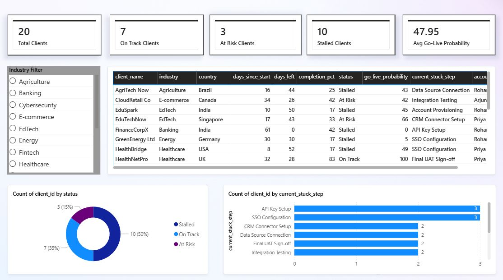
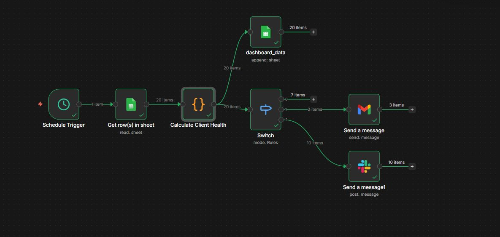
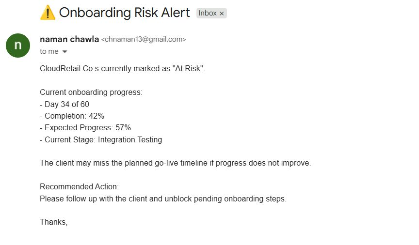

# 🚦 Enterprise Go-Live Tracker

> What actually causes enterprise onboarding timelines to slip — before anyone realizes it's too late?

That question is what started this project.

Most enterprise software deployments don't fail loudly. They fail silently — a client goes quiet, a step gets stuck, and nobody notices until it's Day 59 of 60. By then it's too late to fix anything.

I built a system to catch those stalls automatically, surface the patterns behind them, and give the right person the right information before the deadline passes.

---

## 📸 Project Overview

### PowerBI Dashboard


### n8n Automation Workflow


### Live Email Alert (Gmail)



---

## 🔍 The Problem This Solves

When a B2B SaaS company promises a client go-live in 60 days, the pressure is real — enterprise contracts, implementation teams, and revenue recognition all depend on hitting that date.

The breakdown usually isn't technical. It's visibility. Nobody has a single place to see:
- Which clients are falling behind their expected pace
- Which onboarding step is causing the most failures across all clients
- How much contract value is silently at risk right now

This project builds that visibility layer — automated, daily, and actionable.

---

## 🏗️ What I Built

**Two connected pieces:**

### Part 1 — n8n Automation Workflow
Runs every morning at 9am. For each of the 20 active enterprise clients it:
- Reads client onboarding data from Google Sheets
- Calculates days elapsed, completion %, expected pace, and pace delta
- Classifies each client as On Track / At Risk / Stalled
- Writes all calculated fields back to a dashboard data sheet
- Sends a Slack alert for stalled clients (account manager notification)
- Sends a Gmail alert for at-risk clients (structured onboarding risk report)

### Part 2 — PowerBI Dashboard
Reads from the processed Google Sheets data and shows:
- **Command strip** — Total clients, On Track, At Risk, Stalled, Avg Go-Live Probability
- **Client health table** — Every client with days left, completion %, status, and current stuck step
- **Status distribution** — Donut chart showing the split across all three statuses
- **Bottleneck radar** — Which onboarding steps are causing the most failures across all clients
- **Industry filter** — Slicer to drill down by sector

---

## 📊 What the Data Showed

Across 20 mock enterprise clients spanning Banking, Healthcare, E-commerce, Logistics, Fintech and more:

- **10 of 20 clients stalled** before reaching go-live
- **Average go-live probability: 47.95%** — below the halfway mark


The insight that matters: when two completely different clients from different industries get stuck on the same step — that's not a client problem. That's a product problem. Fixing the UX of those two steps would immediately unblock 30% of all active clients.

---

## 🛠️ Tech Stack

| Tool | Role |
|---|---|
| **n8n** | Workflow automation — scheduling, calculation, routing, alerts |
| **JavaScript** | Logic inside the n8n Code node |
| **Google Sheets** | Data storage — source data, calculated output, alert log |
| **PowerBI** | Dashboard and visualization layer |
| **Gmail** | At-risk client email alerts |
| **Slack** | Stalled client account manager notifications |

---

## 📁 Repository Structure

```
enterprise-golive-tracker/
│
├── assets/
│   ├── dashboard.png          # PowerBI dashboard screenshot
│   ├── workflow.png           # n8n workflow screenshot
│   ├── email_alert.png        # Gmail alert screenshot
│ │
├── data/
│   ├── clients.csv            # 20 mock enterprise clients (source data)
│   ├── dashboard_data.csv     # Calculated output (written by n8n)
│  
│├── n8n/
│   └── n8n_workflow.json   # Code node logic
│
├── powerbi/
│   └── golive_tracker.pbix    # PowerBI file 
│
└── README.md
```

---

## ⚙️ How the n8n Code Node Works

**Status classification logic:**

| Condition | Status |
|---|---|
| `hoursSinceActivity > 120` OR `paceDelta < -40` | 🔴 Stalled |
| `hoursSinceActivity > 72` OR `paceDelta < -15` | 🟡 At Risk |
| Everything else | 🟢 On Track |

**Go-live probability** starts at 70, adjusts by `paceDelta × 1.2`, then penalises At Risk (−10) and Stalled (−25). Capped between 0 and 100.

---

## 📋 Data Schema

### clients (source — 20 rows)

| Column | Type | Description |
|---|---|---|
| client_id | Text | Unique identifier (C001–C020) |
| client_name | Text | Company name |
| industry | Text | Sector (Banking, Healthcare, etc.) |
| country | Text | Client country |
| start_date | Text (YYYY-MM-DD) | Onboarding day 1 |
| total_steps | Number | Total onboarding steps (12) |
| steps_completed | Number | Steps completed so far |
| current_stuck_step | Text | Step currently in progress |
| last_activity_date | Text (YYYY-MM-DD) | Last recorded client activity |
| account_manager | Text | Assigned AM (Rohan/Priya/Arjun) |
| is_active | Boolean | Active client flag |

---

## 🚀 How to Reproduce This

**1. Set up Google Sheets**
- Create a new spreadsheet with 2 tabs: `clients`,  `dashboard_data`
- Import the CSV files from `/data/` into the corresponding tabs
- Set date columns to Plain Text format — critical to prevent Google Sheets auto-conversion breaking n8n date parsing

**2. Set up n8n**
- Create a new workflow
- Add: Schedule Trigger → Get rows (Google Sheets) → Code node → Switch → Gmail / Slack / Google Sheets write-back
- Paste the code from `/n8n/calculate_client_health.js` into the Code node
- Connect your Google Sheets, Gmail, and Slack credentials

**3. Set up PowerBI**
- Open PowerBI Desktop
- Get Data → Google Sheets (or import CSVs directly)
- Build relationships: `clients[client_id]` → `dashboard_data[client_id]`
- Create DAX measures for On Track, At Risk, Stalled counts and Revenue at Risk
- Build visuals as shown in the dashboard screenshot

---

## 💡 Key Takeaway

The most interesting thing I found while building this wasn't in the data — it was the moment the Gmail alert actually fired for a stalled client. Seeing "Day 34 of 60 — Completion: 42% — Expected: 57%" land in an inbox made the problem feel real in a way the dashboard alone didn't.

A dashboard tells you what's happening. An automated alert tells someone what to do about it right now. Both matter, but they serve different people at different moments. That distinction — who needs what information, when, and in what form — is the actual product question underneath all of this.

---

## 👤 About

Built by **Naman Chawla** — exploring the intersection of product thinking and data.

[LinkedIn](https://linkedin.com/in/naman2026) · [GitHub](https://github.com/PeakyKumar)

---

*This project uses mock data. No real client information was used.*
